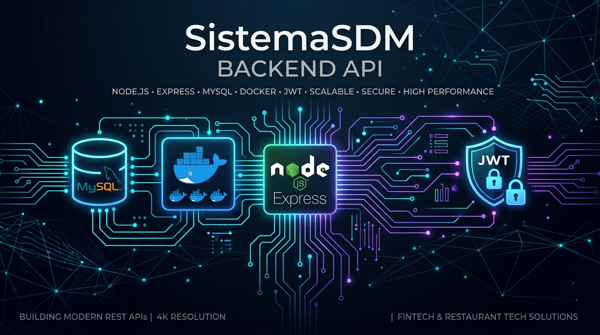
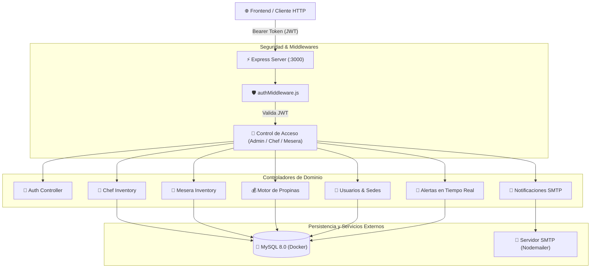

<div align="center">



# 🍽️ SistemaSDM - Backend REST API

**Plataforma Integral de Gestión Gastronómica Multi-Sede**  
*Control de Inventarios • Distribución Inteligente de Propinas • Control de Acceso RBAC • Notificaciones Automáticas*

[](https://nodejs.org/)
[](https://expressjs.com/)
[](https://www.mysql.com/)
[](https://www.docker.com/)
[](https://jwt.io/)
[](https://jestjs.io/)

</div>

---

## 📌 Descripción del Proyecto

**SistemaSDM API** es una solución de backend robusta, modular y escalable diseñada para optimizar las operaciones diarias en restaurantes con múltiples sedes. Proporciona una interfaz RESTful segura que centraliza la administración de inventarios diferenciados por área (cocina y salón), asignaciones diarias del personal, un motor matemático de liquidación de propinas y un sistema reactivo de alertas y correos electrónicos.

---

## 🏛️ Arquitectura y Módulos del Sistema

<div align="center">


</div>

### Diagrama de Flujo de Datos



---

## ✨ Funcionalidades Principales

### 1. 🔐 Autenticación y Control de Acceso Basado en Roles (RBAC)
- **Cifrado de Alta Seguridad:** Contraseñas hasheadas mediante `bcrypt` con salt rounds configurable.
- **Tokens Stateless:** Emisión y validación de tokens JWT (`jsonwebtoken`) con expiración automática.
- **Middlewares de Roles:**
  - `verificarToken`: Valida la autenticidad e integridad del token recibido en la cabecera `Authorization: Bearer <token>`.
  - `verificarRolAdmin`: Acceso exclusivo para directores y administradores.
  - `verificarRolChefOAdmin`: Acceso a operaciones de cocina e inventarios gastronómicos.
  - `verificarRolMeseraOAdmin`: Acceso a inventarios de barra, insumos de salón y turnos de atención.

### 2. 📦 Gestión Especializada de Inventarios
- **Inventario de Cocina (Chef):** Seguimiento en tiempo real de insumos perecederos y materias primas culinarias, control de stock actual y umbrales de stock mínimo.
- **Inventario de Salón (Meseras):** Registro y control de insumos de servicio, cristalería, vajilla y consumibles de mesas.
- **Detección Automática de Quiebres:** Generación inmediata de alertas cuando un ítem cae por debajo de su cantidad crítica.

### 3. 💵 Motor Inteligente de Cálculo de Propinas
- **Gestión por Semanas y Sedes:** Apertura, registro y cierre ordenado de periodos de liquidación.
- **Algoritmo de Reparto Ponderado:**
  - Ponderación basada en las horas trabajadas por colaborador.
  - Distribución proporcional configurable por cargo o puntos.
  - Registro de auditoría con la distribución exacta entregada a cada trabajador.

### 4. 🔔 Sistema de Alertas y Avisos
- Notificaciones internas asociadas a eventos de inventario o mensajes operativos entre cocina, salón y administración.
- Indicador de estado (`leída` / `no leída`) y conteo centralizado para sincronización visual con la interfaz de usuario.

### 5. 📧 Notificaciones Automatizadas por Correo (Nodemailer)
- Integración con servidor SMTP para el despacho de resúmenes de distribución de propinas, confirmaciones operativas y reportes consolidados en formato HTML responsive.

---

## 🗂️ Estructura del Código Fuente

```text
SistemaSDM/
├── 📁 database/
│   ├── init.sql                      # Inicialización DDL y datos semilla
│   ├── chef_table.sql                # Esquema de inventario de cocina
│   ├── meseras_table.sql             # Esquema de insumos de salón
│   ├── alertas_table.sql             # Esquema del sistema de alertas
│   ├── asignaciones_diarias_table.sql# Esquema de turnos de personal
│   └── update_sedes.sql              # Migración para soporte multi-sede
├── 📁 docs/
│   └── 📁 assets/                    # Diagramas y banners de documentación
├── 📁 src/
│   ├── 📁 config/
│   │   └── db.js                     # Pool de conexiones a MySQL (mysql2/promise)
│   ├── 📁 controllers/
│   │   ├── authController.js         # Lógica de login y sesión
│   │   ├── chefController.js         # CRUD inventario cocina
│   │   ├── meseraController.js       # CRUD inventario salón
│   │   ├── propinasController.js     # Motor matemático de cálculo y cierre
│   │   ├── usuariosController.js     # Administración de usuarios y sedes
│   │   ├── alertaController.js       # Gestión de avisos y lecturas
│   │   ├── emailController.js        # Despacho de correos electrónicos
│   │   └── asignacionesController.js # Asignación de turnos y colaboradores
│   ├── 📁 middlewares/
│   │   └── authMiddleware.js         # Filtros JWT y autorización RBAC
│   ├── 📁 routes/                    # Definición de endpoints y asociación con middlewares
│   ├── app.js                        # Configuración y middlewares de Express
│   └── index.js                      # Punto de entrada y levantamiento del servidor
├── 📁 tests/
│   ├── auth.test.js                  # Pruebas de autenticación y tokens
│   ├── rbac.test.js                  # Pruebas de permisos y restricciones de rol
│   ├── propinas.test.js              # Pruebas del algoritmo de propinas
│   └── health.test.js                # Verificación del endpoint de salud
├── .env.example                      # Plantilla de variables de entorno (segura para Git)
├── .gitignore                        # Reglas estrictas de exclusión para Git
├── docker-compose.yml                # Contenedor aislado de MySQL 8.0
├── package.json                      # Dependencias y scripts del proyecto
└── postman_collection.json           # Colección oficial de endpoints lista para importar
```

---

## 🛣️ Resumen de Endpoints (API Reference)

| Módulo | Método | Endpoint | Roles Permitidos | Descripción |
| :--- | :---: | :--- | :---: | :--- |
| **Salud** | `GET` | `/api/health` | Público | Estado del servidor |
| **Auth** | `POST` | `/api/auth/login` | Público | Autenticación y obtención de JWT |
| **Usuarios** | `GET` | `/api/usuarios` | `Admin` | Listado general de usuarios |
| **Usuarios** | `POST` | `/api/usuarios` | `Admin` | Creación de nuevo usuario |
| **Inventario Chef** | `GET` | `/api/chef` | `Chef`, `Admin` | Listar insumos de cocina |
| **Inventario Chef** | `POST` | `/api/chef` | `Chef`, `Admin` | Registrar nuevo insumo |
| **Inventario Chef** | `PUT` | `/api/chef/:id` | `Chef`, `Admin` | Actualizar stock de insumo |
| **Inventario Mesera** | `GET` | `/api/meseras` | `Mesera`, `Admin` | Listar insumos de salón |
| **Inventario Mesera** | `POST` | `/api/meseras` | `Mesera`, `Admin` | Registrar consumo o insumo |
| **Propinas** | `GET` | `/api/propinas/semanas` | `Admin` | Historial de semanas registradas |
| **Propinas** | `POST` | `/api/propinas/calcular` | `Admin` | Ejecutar cálculo de distribución |
| **Propinas** | `POST` | `/api/propinas/guardar` | `Admin` | Guardar liquidación semanal |
| **Alertas** | `GET` | `/api/alertas` | Todos autenticados | Listado de alertas de la sede |
| **Alertas** | `PUT` | `/api/alertas/:id/leida` | Todos autenticados | Marcar alerta como leída |
| **Email** | `POST` | `/api/email/enviar-reporte`| `Admin` | Envío de reporte por correo |
| **Asignaciones**| `GET` | `/api/asignaciones` | `Admin` | Asignaciones diarias por sede |

> 💡 *Para una exploración interactiva completa, consulta el archivo [postman_collection.json](postman_collection.json).*

---

## ⚙️ Variables de Entorno

Crea tu archivo `.env` a partir de la plantilla incluida:

```bash
cp .env.example .env
```

| Variable | Descripción | Valor por Defecto |
| :--- | :--- | :--- |
| `PORT` | Puerto donde escucha el servidor Express | `3000` |
| `DB_HOST` | Host de la base de datos MySQL | `127.0.0.1` |
| `DB_PORT` | Puerto expuesto de MySQL en Docker | `3307` |
| `DB_USER` | Usuario de MySQL | `root` |
| `DB_PASSWORD` | Contraseña de la base de datos | *(Configurada en docker-compose)* |
| `DB_NAME` | Nombre de la base de datos relacional | `sistemasdm` |
| `JWT_SECRET` | Clave criptográfica para la firma de tokens | *(Cadena secreta personalizada)* |
| `EMAIL_USER` | Correo electrónico emisor (SMTP) | *(Tu correo)* |
| `EMAIL_PASS` | Contraseña de aplicación SMTP | *(Token de app)* |

---

## 🚀 Puesta en Marcha Local

### 1. Requisitos
- **Node.js** v18 o superior
- **Docker** y **Docker Compose**

### 2. Instalación de Dependencias
```bash
npm install
```

### 3. Levantar la Base de Datos con Docker
```bash
docker compose up -d
```
> Esto iniciará un contenedor MySQL 8.0 en el puerto `3307` e inicializará automáticamente las tablas mediante el archivo `database/init.sql`.

### 4. Ejecutar el Servidor en Modo Desarrollo
```bash
npm run dev
```
El servidor quedará disponible en `http://localhost:3000`.

---

## 🧪 Pruebas Automatizadas

El proyecto cuenta con una batería completa de pruebas unitarias y de integración desarrolladas con **Jest** y **Supertest**:

```bash
npm test
```

### Suites de Prueba:
- **`tests/auth.test.js`**: Pruebas de login exitoso, credenciales inválidas y generación de tokens.
- **`tests/rbac.test.js`**: Validación de restricciones 403/401 según el rol del usuario (`Admin`, `Chef`, `Mesera`).
- **`tests/propinas.test.js`**: Verificación matemática del reparto proporcional de propinas y cálculo de horas.
- **`tests/health.test.js`**: Comprobación del estado de salud del servidor y disponibilidad general.

---

## 🔒 Buenas Prácticas de Seguridad Implementadas

1. **Sin secretos en el repositorio:** Archivo `.gitignore` blindado que excluye `.env`, logs y temporales.
2. **Consultas Parametrizadas:** Protección contra inyecciones SQL mediante `mysql2/promise` y sentencias preparadas.
3. **Manejo Centralizado de Errores:** Respuestas JSON consistentes con códigos de estado HTTP semánticos (`400`, `401`, `403`, `404`, `500`).
4. **CORS Configurado:** Permite controlar el origen autorizado de peticiones provenientes del frontend.

---

<div align="center">
Desarrollado con dedicación para <b>SistemaSDM</b>.
</div>
